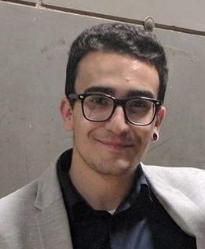

# Mirco Grillo
Software Developer. Python lover. Always curious.

<a href="mailto:mirco.grillomg@gmail.com">mirco.grillomg@gmail.com</a>
| <a href="https://linkedin.com/in/mirco-grillo-680a96117/">Linkedin Profile</a>
| <a href="https://github.com/iflare3g/">Github Profile</a>

## Currently

Fullstack Developer - __OTIX srl__  [website](https://otix.it). 

__Current stack__
  - Python
  - Django
  - ReactJS
  - GatsbyJS 
  - NextJS
  - HTML5, CSS3/SASS, Javascript
  - MySQL/Postgres
  - Docker
  - PaaS ( Heroku, Netlify )
  - IaaS ( AWS )

## Employment

`Dec 2017 - Jul 2018`
__World Food Programme for Softlab Innovation__.  
__Where__: Rome(IT)
  - Django Developer
  - Project:   
        Telephone Management System to handle WFP Users calls’ billing files and generate cost files, handling SIM  assignments, personal or business calls.
  - Tech stack:   
        Django 1.8, PostgresSQL, HTML,CSS,JS, pytest and selenium, Jenkins as CI, JIRA Board, Git

`Mar 2017 - Oct 2017`
__Bway Engineering & Consulting__.  
__Where__: Rome(IT)
  - Python Developer
  - Project:   
        Alcantara Monitoring System is an IoT architechture where we have built everything, from devices to the web app to visualize data sent from them.
The devices have been thrown into the sicilian Alcantara river to take data about its speed, temperature and geo position. Every device sent data to a service developed with Flask microframework, called by frontend to visualize on a map the devices with their data to make calculations.
  - Tech stack:   
        Python 2.x, Flask, HTML,CSS,Jquery, Ajax, Bootstrap, Raspberry PI 3 with Debian, Arduino

`Aug 2016 - Sep 2016`
__ECCO Shoes__.  
__Where__: Dublin(IRE)
  - Sales Assistant
  - I mainly deal with the sale of ECCO Shoes merchandise and ware-house management. This experience is mainly served for English. I got the TOEFL B1/B2 Certificate at the end of this experience.

`Oct 2015 - Nov 2015`
__TIGER Shop__.  
  - I have been dealing mainly with the management of the store ware-house and the management of the various sections of  products present and sold by the company. The main goal was to stay as close as possible to local people for improving English.

## Education

`2015 - Currently`
__INFORMATICS ENGINEERING__.     
Uninettuno University

`2016 - 2017`
__CISCO Skillzone Program__.  
  - I attended the pilot project of Cisco in Italy at Elis College, 
  focusing on aspects mainly related to IT,networking and data analysis, 
  using Python technologies(Pandas, Numpy, Scikit-learn, etc.) and develop-ing small 
  algorithms Machine Learning and Neural Networks, using, for example, TensorFlow.

`2015 - 2016`
__IT SYSTEM ARCHITECT__. 
  - ELIS College
  - I studied at ELIS College in Rome
    where I have developed knowledge 
    mainly in these areas: OOP Java SE 7;
    Network-ing;Security;Database(MySQL)

`2010 - 2015`
__DIPLOMA__. 
  - ITIS E. Ferrari 
  - I graduate in informatics, where I have undertaken 
    studies relating to computer networks, 
    software development,relational databases and computer technology designing systems.
  - Final rating: 100 cum Laude

## Awards

`2016`
THIRD PLACE NASA SPACE APPS CHALLENGE

`2015`
ROTARY CLUB MEMBERSHIP

## Certificates

`2016`
JAVA SE 7 OCA

`2015`
LINUX LPIC-1 101-102

## Hobbies

- Open Source contributions -> [PyRoma](https://github.com/PyRoma/PyRoma-website), [Python Italia Telegram Bot](https://github.com/Kavuti/python-italy-telegram-bot), [Magical Commands for BASH](https://github.com/championballer/Magical-Commands-for-BASH)
- Reading and learning
- Crossfit
- Snowboarding

<!-- ### Footer

Last updated: Jul 2019 -->
